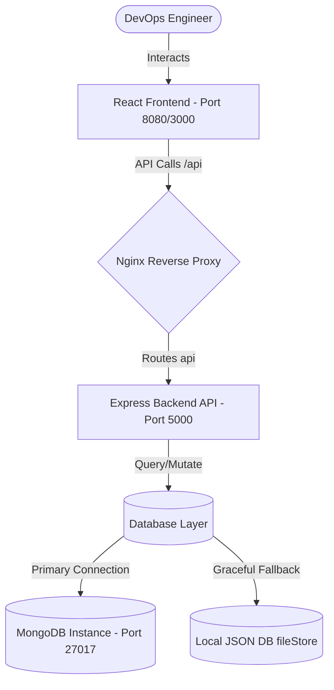

# ♾️ DevFlow: Full-Stack DevOps & Task Dashboard

Welcome to **DevFlow**, a state-of-the-art, recruiter-ready Full-Stack DevOps & Task Dashboard built to showcase automated pipelines, infrastructure health monitoring, and interactive task management. 

DevFlow bridges the gap between software development and system operations by providing developers with an elegant control console to manage task boards, track server health, and trigger simulated or real production deployment workflows with live-scrolling CLI logs.

---

## 🚀 Key Features

1. **Interactive Glassmorphic DevOps Dashboard**: Beautiful Outfit-based UI utilizing custom HSL color systems, glassmorphism, responsive metrics grid, and smooth CSS micro-animations.
2. **Animated CD Pipeline Visualizer**: Real-time stage progression tracker illustrating **Commit ➔ Docker Build ➔ Test Suites ➔ Push Release ➔ EC2 Deploy** with animated connection indicators and state status rings.
3. **Automated Live Runner Log Console**: A high-fidelity JetBrains Mono terminal mimicking standard GitHub Actions runners, outputting dynamic logs line-by-line as each stage completes.
4. **DevOps Task Board**: Drag-and-drop / single-click style Kanban workflow manager supporting creating, assigning, updating statuses, and pruning system engineering tasks.
5. **System Telemetry Panel**: Live endpoint reading system resource limits (Memory, RSS, Uptime) and active database clusters.
6. **MongoDB Connection Fallback Protocol**: An in-house hybrid DB management layer that connects to Mongoose but gracefully falls back to an encapsulated local JSON file database if MongoDB is not running locally. **Runs out-of-the-box on any machine.**

---

## 🛠️ Architecture & Technology Stack



* **Frontend**: React 18, TypeScript, Vite, Lucide Icons, Glassmorphic CSS variables.
* **Backend**: Node.js, Express, Winston Logger, Mongoose, Dotenv.
* **Infrastructure**: Nginx (reverse proxy, SPA router), Docker, Multi-stage Dockerfiles, Docker Compose.
* **Automations**: GitHub Actions (Linting, Compilation, Docker Hub building/pushing, SSH remote EC2 deployments).

---

## 📦 Local Installation & Setup Guide

Ensure you have [Node.js (v18+)](https://nodejs.org/) installed. Git and [Docker Desktop](https://www.docker.com/) are optional but recommended.

### Option A: Standalone Development Run (No Docker Required)

This is the easiest way to launch DevFlow quickly for demonstration purposes.

1. **Initialize the Backend**:
   ```bash
   cd backend
   npm install
   npm run dev
   ```
   *Note: The backend will attempt to connect to MongoDB. If MongoDB is not running, it will automatically log a connection warning and establish a local JSON database database (`local_db.json`), meaning **everything remains fully functional!***

2. **Initialize the Frontend**:
   Open a new terminal window:
   ```bash
   cd frontend
   npm install
   npm run dev
   ```
   
3. **Access the App**:
   Navigate to **[http://localhost:3000](http://localhost:3000)** in your web browser.

---

### Option B: Orchestrated Multi-Container Run (Using Docker Compose)

This simulates production environments locally by packaging Frontend, Backend, and MongoDB into structured docker networks.

1. **Run Docker Compose**:
   From the main directory root:
   ```bash
   docker-compose up -d --build
   ```

2. **Verify Containers**:
   ```bash
   docker-compose ps
   ```
   This will spin up three containerized resources:
   * **devflow_db**: Port `27017` (MongoDB server)
   * **devflow_backend**: Port `5000` (Node API application)
   * **devflow_frontend**: Port `8080` (React application served securely by Nginx)

3. **Access the App**:
   Navigate to **[http://localhost:8080](http://localhost:8080)** in your web browser.

---

## 📈 Dashboard Walkthrough

### 1. Triggering CD Deployments
* Locate the **Interactive CD Pipelines** section.
* Click **Trigger Release**.
* Observe the **Pipeline Stage Visualizer**: circles glow and pulse as each stage (Commit, Build, Test, Release, Deploy) validates.
* Follow the logs in the **CI/CD Deployment Runner logs** console as they auto-scroll and document compilation metrics, code coverage, layer pushes, and Nginx configuration reloads in real-time.

### 2. Operations Task Management
* Click **Create Task** to open the modal.
* Enter a title, description, priority (low, medium, high), and assignee, then click **Create Task**.
* Update statuses by using the directional arrows on each Kanban card (`←` and `→`) to move cards through columns.
* Delete outdated tasks using the red Trash icon on the top-right of the card.

---

## 🛡️ CI/CD Production Workflows (GitHub Actions)

The production-grade workflow located in `.github/workflows/ci-cd.yml` automates core DevOps standards:
1. **Quality Gate**: Runs ESLint, TypeScript compiler checks, and testing suites.
2. **Container Registry**: Packages code via multi-stage optimized alpine Dockerfiles and pushes secure image tags to Docker Hub.
3. **Deployment Tunnel**: Establishes a highly secure SSH socket tunnel to target AWS EC2 instances, pulls images, and recreates instances dynamically with zero server interruption:
   ```yaml
   docker-compose up -d --force-recreate
   ```
